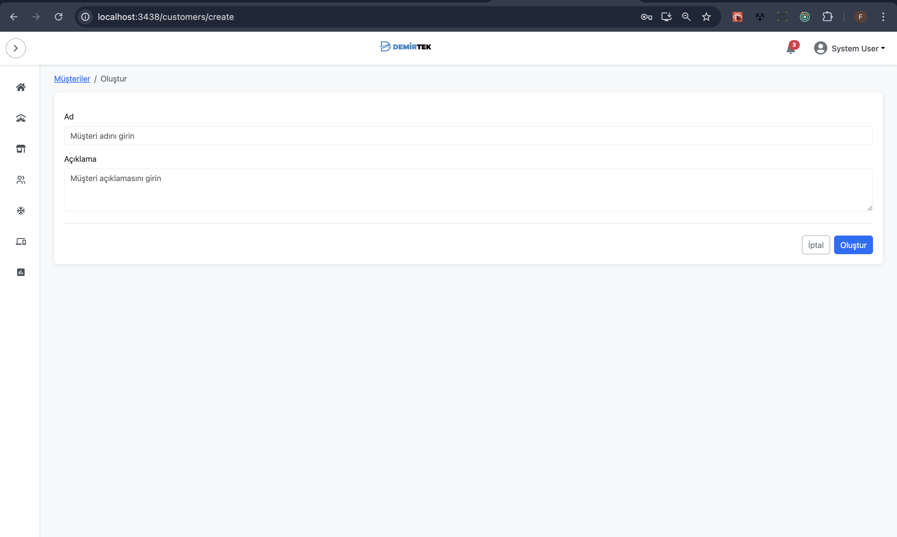
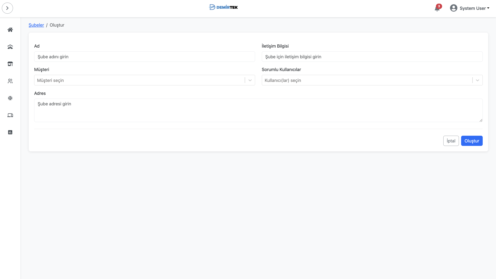
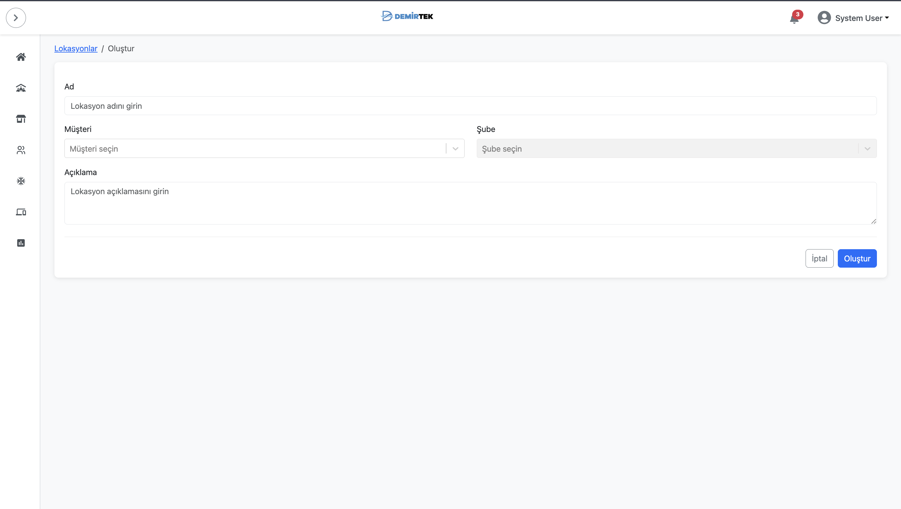
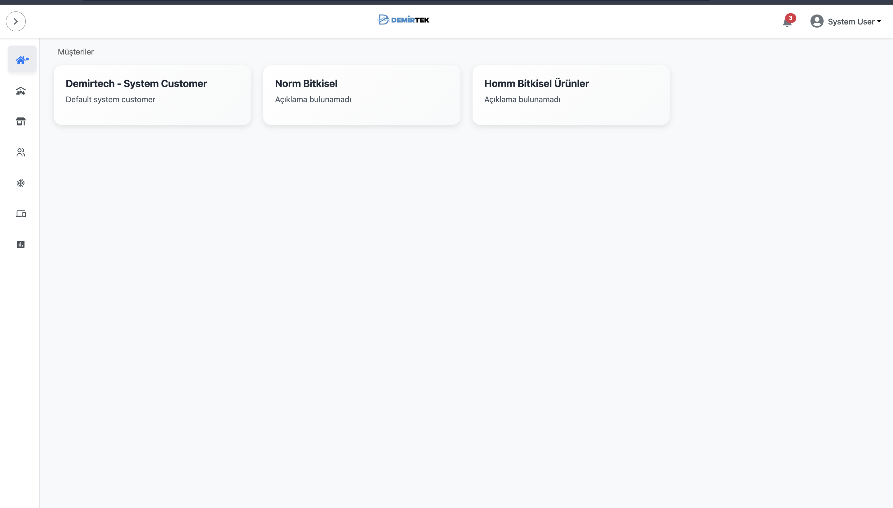
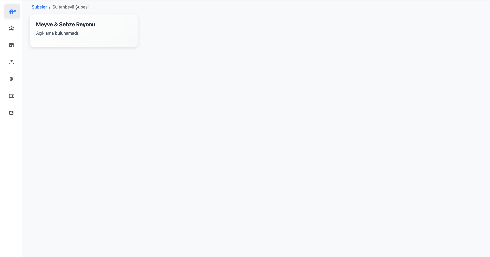
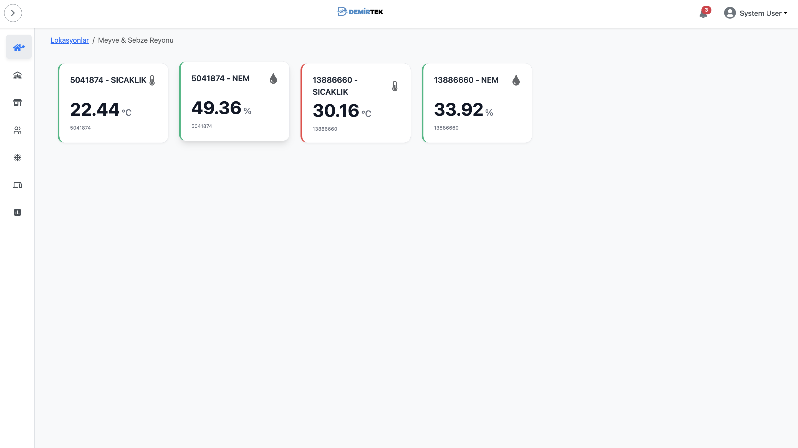

# Demirtech

**Demirtech**, kendi geliştirdiğimiz akıllı donanım cihazları üzerinden anlık sıcaklık ve nem verileri toplayarak; eczaneler, soğuk hava depoları ve ticari klima sistemleri gibi alanlarda çevrimiçi izleme ve kontrol imkânı sunan kapsamlı bir **IoT** projesidir.  
Sistem, hem son kullanıcıların hem de yöneticilerin ortam koşullarını uzaktan ve gerçek zamanlı takip etmelerini sağlar. Ayrıca kritik eşiklerin aşılması durumunda anlık bildirim mekanizmalarıyla hızlı müdahale fırsatı sunar.

Bu proje ile sıcaklık ve nem takibinin hayati önem taşıdığı sektörlerde, operasyonel verimlilik artırılırken; insan hatasından kaynaklı riskler minimize edilmekte ve süreçler dijitalleşerek daha güvenli hale getirilmektedir.

---

## Projede Kullanılan Teknolojiler 🚀

### Backend
- **Node.js** & **Express.js**: Hızlı, güvenli ve ölçeklenebilir API mimarisi.
- **MongoDB**: Esnek ve güvenilir veri depolama altyapısı.
- **JWT (JSON Web Token)** & **Bcrypt.js**: Kullanıcı kimlik doğrulama ve veri güvenliği yönetimi.

### Haberleşme Protokolleri
- **MQTT** & **WebSocket**: IoT cihazlarıyla düşük gecikmeli ve güvenli veri iletişimi.

### Frontend
- **React**: Modern ve kullanıcı dostu web arayüzleri geliştirme.
- **Redux Toolkit**: Durum yönetimi ve uygulama veri akışı kontrolü.
- **Müşteri ve Admin Panelleri**: Kullanıcı rollerine özel deneyim sunulması.

---

## Projeye Başlarken 📦

Projeyi kendi bilgisayarınıza klonladıktan sonra, çalıştırabilmek için bazı ön hazırlıkların yapılması gerekmektedir:

1. `server` klasörünün kök dizininde `.env` adında bir dosya oluşturun.
2. `server/.env-example` dosyasındaki tüm içerikleri kopyalayıp yeni `.env` dosyanıza yapıştırın.
3. Aynı işlemi **admin** ve **client-web** dizinlerinde de gerçekleştirin.

Bu adımlar, projenin doğru şekilde çalışabilmesi için gerekli tüm çevresel değişkenleri sağlar.

---

## Projeyi Çalıştırmak 🔧

Projeyi çalıştırabilmek için sisteminizde bir Docker engine (**OrbStack** veya **Docker Desktop** gibi) kurulu olmalıdır.

Adım adım yapılması gerekenler:

1. Projeyi local ortamınıza klonladıktan sonra proje ana dizinine geçin.
2. Docker imajlarını oluşturmak için terminalden aşağıdaki komutu çalıştırın:
   ```bash
   docker compose build
   ````
3. Daha sonrasında aşağıdaki komut ile container'ları çalıştırın:
    ```bash
    docker compose up -d
    ````
4. Browser'ınızdan admin paneline ulaşmak için;
    ```bash
    http://localhost:3438
    ```
    Müşteri paneline ulaşmak için;
    ```bash
    http://localhost:3439
    ```
    adreslerine giriş yapın.

## Uygulamaya Giriş Yapmak 🔑

Uygulamayı kullanmaya başlamak için aşağıdaki kullanıcı bilgilerini kullanarak giriş yapmanız gerekmektedir:

- **Email:** info@demirtech.com
- **Şifre:** 123

Giriş yaptıktan sonra açılan menüden doğrudan uygulamaya erişim sağlayabilirsiniz.

> ⚠️ **Not:** Bu proje hâlen geliştirme aşamasındadır. Bu nedenle client-web uygulaması (müşteri paneli) henüz tamamlanmamıştır. İnceleme yaparken admin paneline odaklanmanız daha doğru olacaktır.

---

## Kullanım Akışı 🚀

### A. Müşteriler

1. **Giriş yaptıktan sonra**, sol menüde yer alan **Müşteriler** sekmesine tıklayarak müşteri yönetim ekranına geçiş yapın.
2. **/customers/** sayfasına yönlendirileceksiniz.
3. Sayfanın sağ üst köşesinde bulunan **Oluştur** butonuna tıklayın.
4. **/customers/create** sayfasına giderek yeni bir müşteri kaydı oluşturabilirsiniz.
5. Aşağıda bulunan resimde de görüleceği üzere Müşteri Adı girilmesi yeterli olacaktır.


### B. Şubeler
1. Şubeler, bir müşteriye ait olan farklı şubeleri temsil etmesi için geliştirilmiş modeldir (ör: Maltepe Şubesi.).
2. Yeni bir şube oluşturmak için **Şubeler** sekmesine tıklayarak şube yönetim ekranına geçiş yapın.
3. Sayfanın sağ üst köşesinde bulunan **Oluştur** butonuna tıklayın.
4. **branches/create** sayfasına yönlendirileceksiniz. Bu sayfada aşağıdaki bir form çıkacaktır. Form'u doldururken bir önceki adımda oluşturmuş olduğunuz müşteriyi seçin.

5. Bu sayfada sistemde migrate edilerek oluşturulan **System User** kullanıcısını tanımlamanız yeterli olacaktır. Bu ilişki müşteri panelinde hangi kullanıcının hangi şubeye ait olduğunu ayırt etmek için kullanılmaktadır.

### C. Lokasyonlar
1. Lokasyonlar, bir şubeye ait olan fiziksel mekanları temsil etmesi için geliştirilmiş bir modeldir (ör: Kat 1, Meyve & Sebze Reyonu.).
2. Yeni bir lokasyon oluşturmak için **Lokasyonlar** sekmesine tıklayarak lokasyon yönetim ekranına geçiş yapın.
3. Sayfanın sağ üst köşesinde bulunan **Oluştur** butonuna tıklayın.
4. **locations/create** sayfasına yönlendirileceksiniz. Bu sayfada aşağıdaki gibi bir form çıkacaktır. Bu adımda, Lokasyon adı, Müşteri ve Şube seçmeniz gerekecektir. Adım A ve Adım B kısımlarında tanımladığımız müşteri ve şubeleri bu adımda seçin, bu şekilde oluşturmuş olduğunuz lokasyonu ilgili şube ile ilişkilendirmiş olacaksınız.


### D. Cihazlar
1. Cihazlar, biz tarafından hazırlanan fiziksel cihazları temsil etmektedir. Burada amaç, fiziksel donanım cihazlarını sistem üzerinde tanımlamaktır. 
2. Her bir donanım cihazını birbirinden ayırt etmek için kullanılan `chipId` alanı bulunmaktadır. Bu alan, işlemciyi satın aldığımız firma tarafından işlemcilerine otomatik olarak atadıkları chipId'i temsil etmektedir. Biz de aslında cihazlarımızı MQTT topiclerinden dinlerken bu chipId alanı ile dinlemekteyiz. 
3. Yeni bir cihaz olulturmak için **Cihazlar** sekmesine tıklayarak cihaz yönetim ekranına geçiş yapın.
4. **devices/create** sayfasına yönlendirileceksiniz. Bu sayfada aşağıdaki gibi bir form çıkacaktır. Bu adımda, **Cihaz Adı**, önceki adımlarda tanımladığınız **müşteri, şube ve lokasyonları** seçiniz. `Donanım tipi` alanını `DT-100` seçiniz. `Ölçüm tipi` için `TEMPERATURE` seçiniz. Cihaz Aktifliğini true olarak set etmeniz gerekmektedir.
5. `Chip ID` alanı için gerçek zamanlı çalışan aşağıdaki chip id'lerden herhangi birini girebilirsiniz: 
  ```bash
  13885865
  ````
  ```bash
  5041874
  ```
  ```bash
  13887456
  ```
  ```bash
  13886660
  ```
  ```bash
  13887517
  ```
6. Kaydettikten sonra, `TEMPERATURE` ölçüm tipi için bir cihaz tanımlamış olacaksınız.
7. Tekrardan Cihazlar sayfasından oluştur butonuna tıklayarak, aynı bilgileri girip, `Ölçüm tipi` için `HUMIDITY` seçiniz. Bu aynı cihaza ait nem sensörlerini okumamızı sağlayacaktır.


### E. Ana Sayfa

1. Bütün sistem tanımlamalarından sonra, sol menüden **Ana Sayfa** sekmesine geçiş yapın.
2. Burada **müşteri**, **şube** ve **lokasyon** seçimi yapmanız gerekmektedir.
3. Örnek bir senaryo üzerinden ilerleyelim:  
   Sistemde kayıtlı olan `Norm Bitkisel` müşterisinin, `Sultanbeyli Şubesi`ne ait `Meyve & Sebze Reyonu` lokasyonundaki cihazları görüntüleyeceğiz.
4. İlk olarak, aşağıdaki alandan müşteri seçimi yapılır:  
   
5. Müşteri seçildikten sonra, sisteme kayıtlı olan ilgili şubeler listelenir ve uygun olan şube seçilir:  
   
6. Seçilen şubeye ait lokasyonlar listelenir. Buradan cihazı tanımladığımız lokasyon seçilir:  
   
7. WebSocket bağlantısı sağlandıktan sonra ekranda seçilen lokasyona ait cihazların **anlık sıcaklık** ve **nem verileri** görüntülenir:  
   